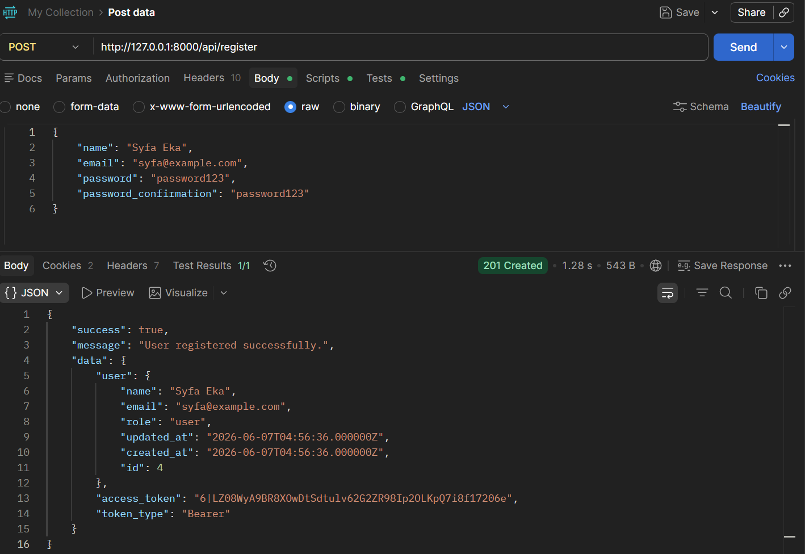
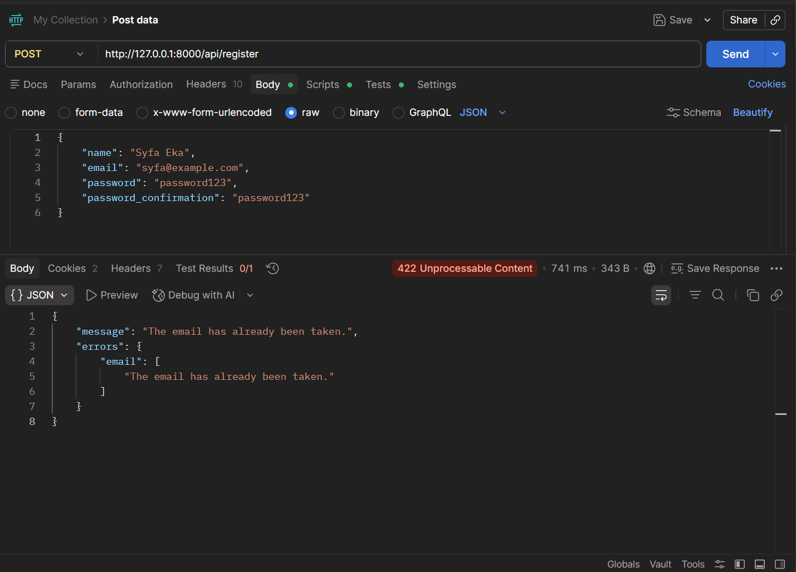
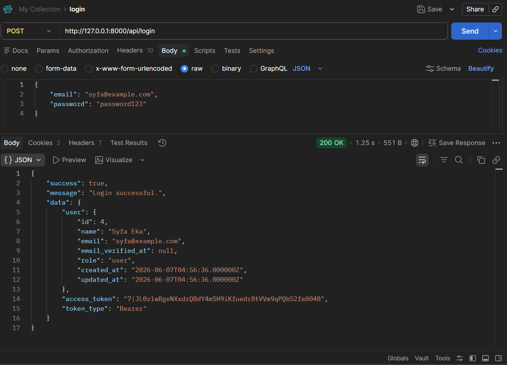
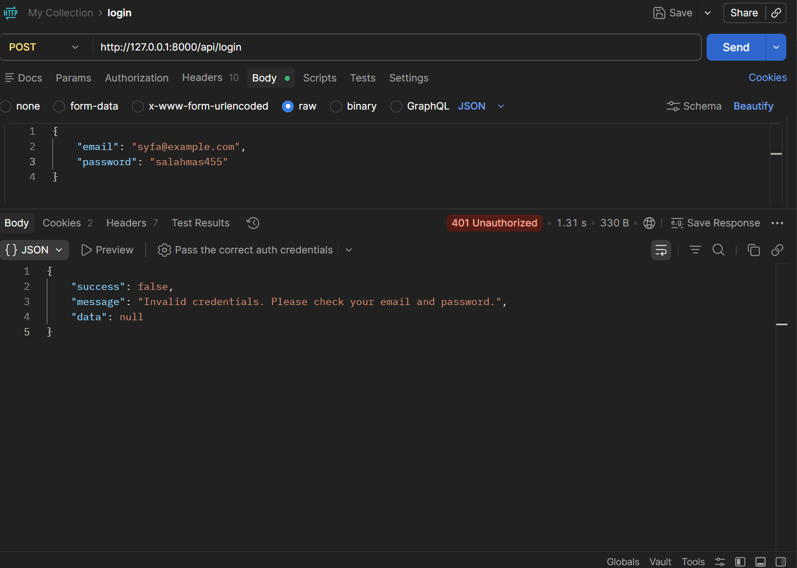
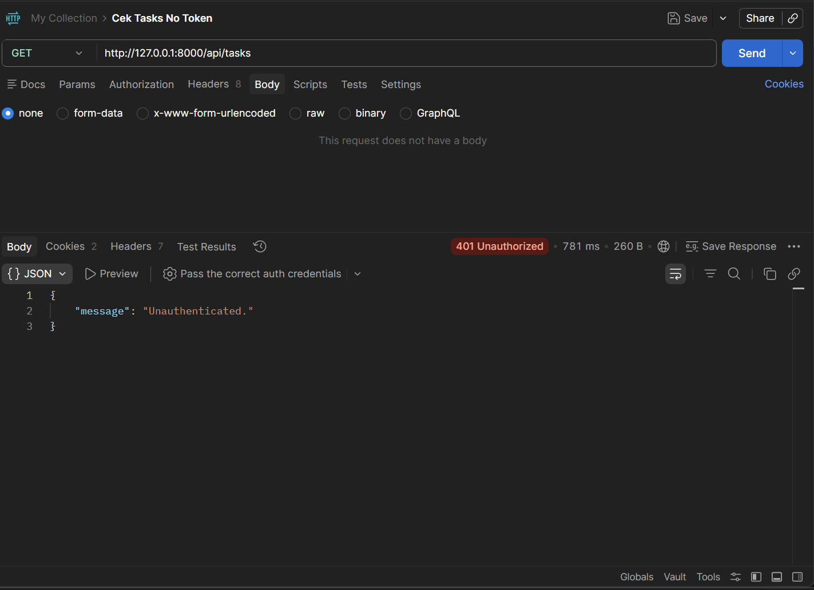
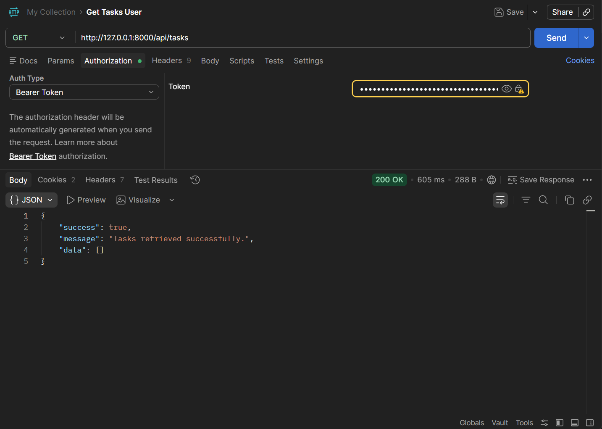
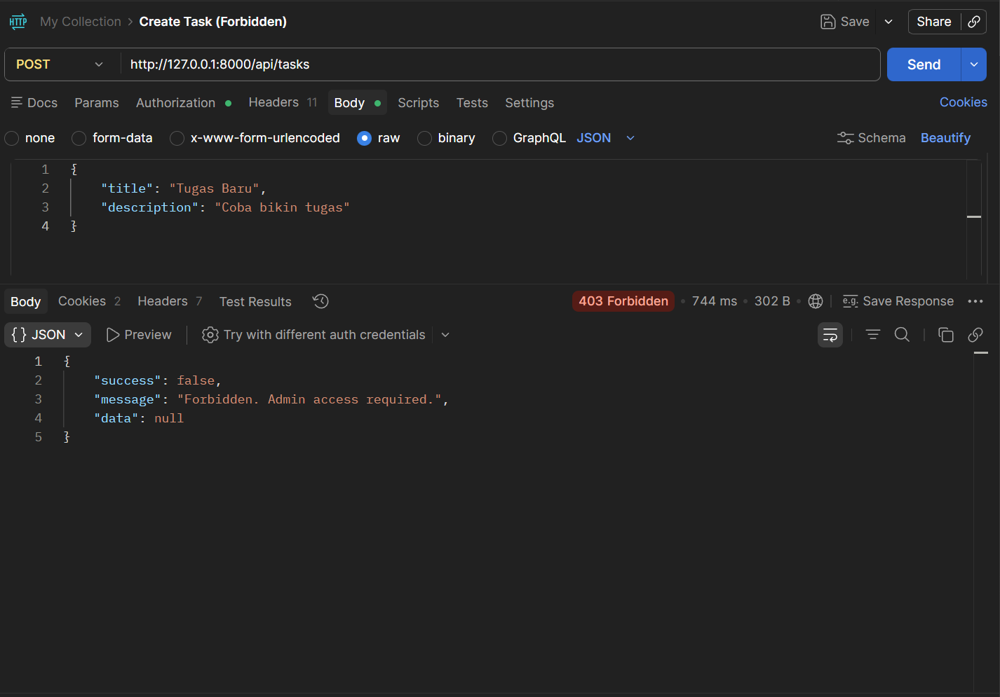
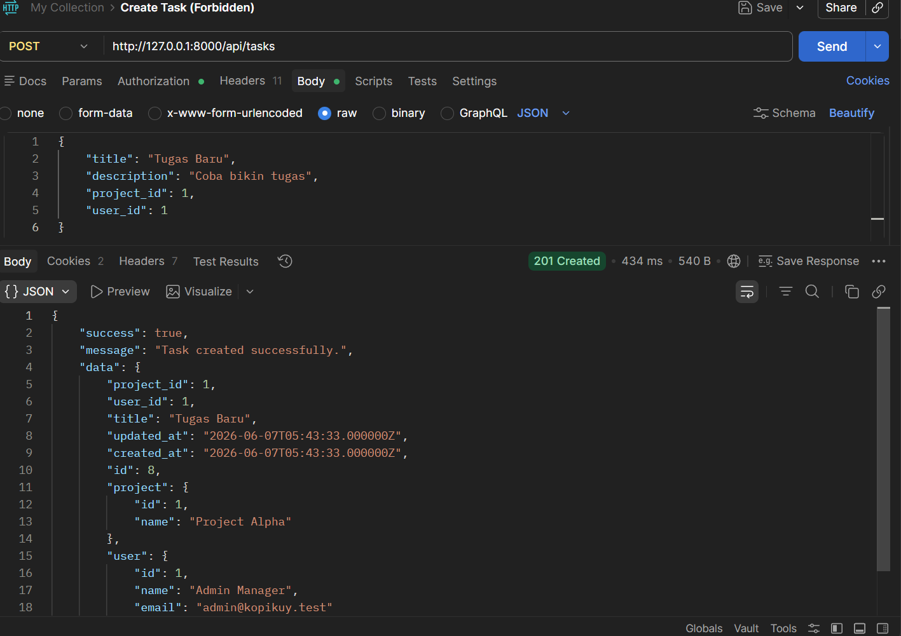
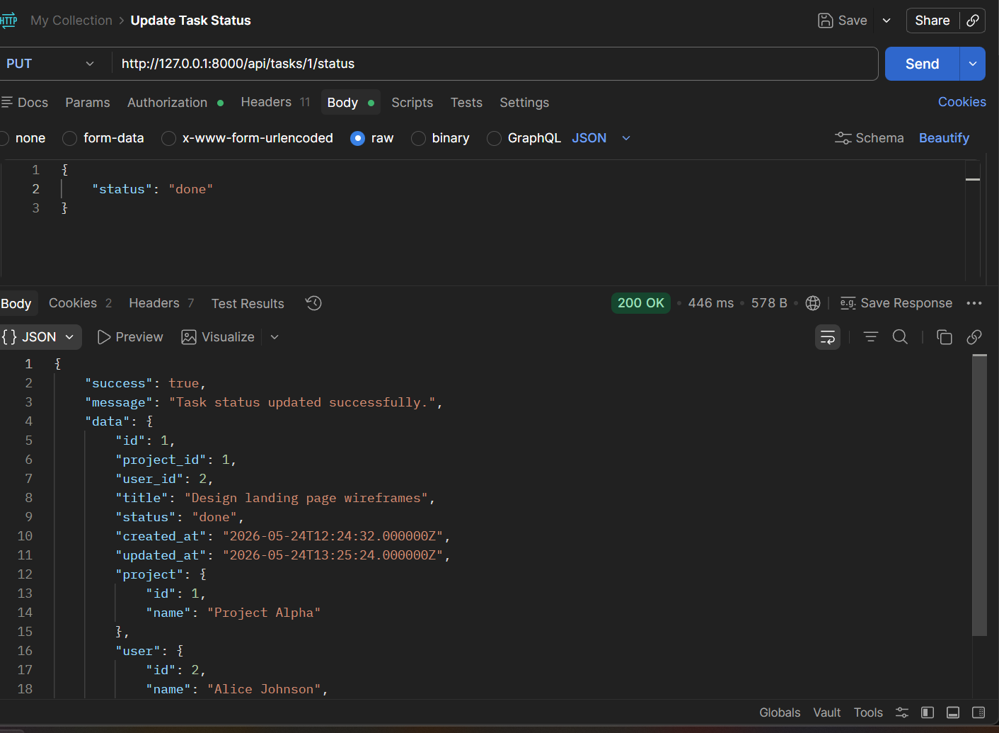
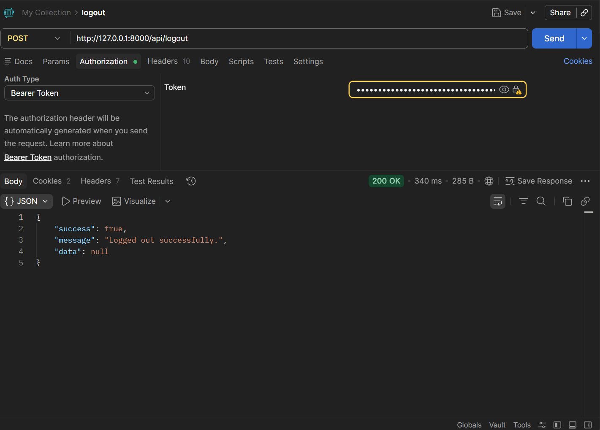

# Task Management API - UTS Pemrograman Web Fullstack

## 👨‍💻 Developer Identity
* **Nama:** Mohammad syfa eka cahyo
* **Universitas:** Universitas PGRI Madiun
* **Program Studi:** Teknik Informatika
* **Semester:** 6
* **Kelas:** B

## 📝 Deskripsi Project
Project ini adalah RESTful API untuk Sistem Manajemen Tugas (Task Management) yang dibangun menggunakan framework Laravel. API ini memfasilitasi pembuatan, pengelolaan, dan pelacakan status tugas dengan menerapkan sistem keamanan Role-Based Access Control (RBAC) menggunakan Laravel Sanctum.

## 🚀 Fitur Utama
* **Authentication & Authorization:** Register, Login, dan Logout menggunakan token Sanctum.
* **Role-Based Access Control (RBAC):** Pemisahan hak akses antara `Admin` (akses penuh) dan `User` (akses terbatas).
* **Project Management:** CRUD data proyek (Khusus Admin).
* **Task Management:** * Admin dapat membuat tugas dan mengalokasikannya ke pengguna tertentu.
  * Pengguna hanya dapat melihat tugas yang ditugaskan kepada mereka.
  * Pengguna dapat memperbarui status tugas mereka (contoh: todo, in_progress, done).
* **Database & Relasi:** Menggunakan Eloquent ORM dengan relasi antar tabel (Users, Projects, Tasks).

## 📸 Dokumentasi Postman (Screenshots)

1. **Register Sukses**

2. **Register Gagal (Email Duplikat)**

3. **Login Berhasil**

4. **Login Gagal (Kredensial Salah)**

5. **Akses Ditolak Tanpa Token**

6. **User Melihat Daftar Task**

7. **User Ditolak Masuk Area Admin**

8. **Admin Berhasil Membuat Task**

9. **Update Status Task**

10. **Logout Berhasil**

📁 **File Export Postman Collection:** [Download JSON disini](public/assets/Task-Management.postman_collection.json)

## 🛠️ Cara Instalasi & Menjalankan Project (Untuk Dosen/Penguji)
1. Clone repository ini.
2. Jalankan perintah `composer install`
3. Copy file `.env.example` menjadi `.env` lalu sesuaikan konfigurasi database.
4. Jalankan `php artisan key:generate`
5. Jalankan migrasi dan seeder: `php artisan migrate:fresh --seed`
6. Jalankan server lokal: `php artisan serve`